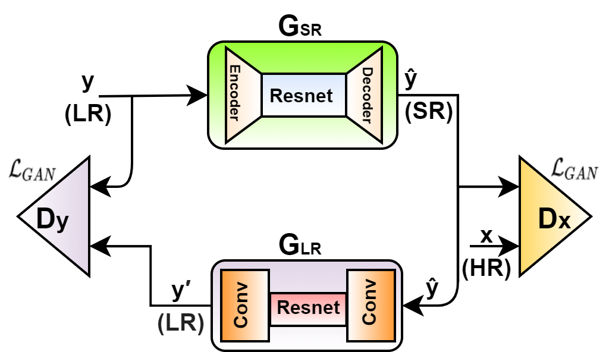
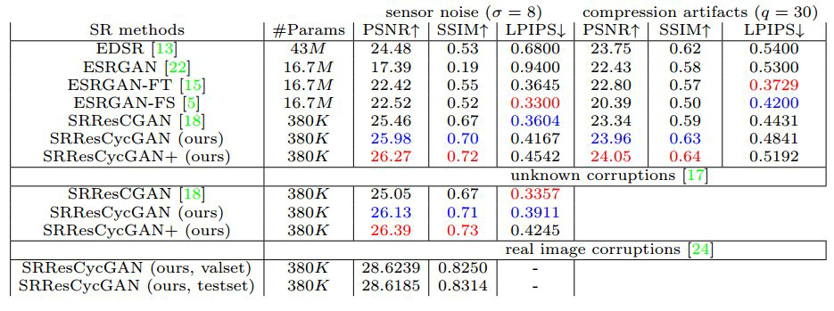
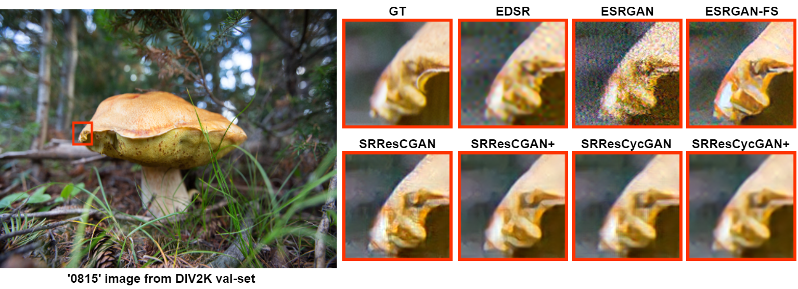
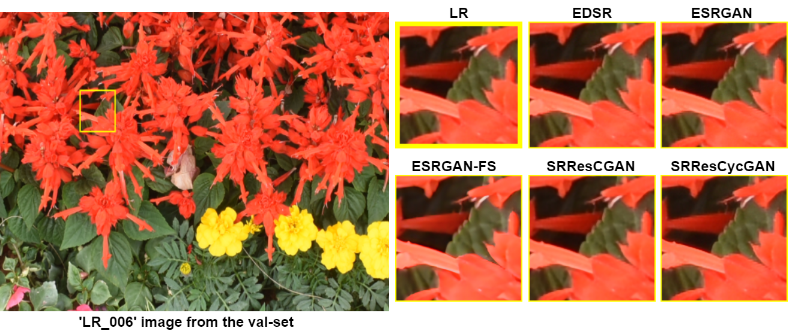
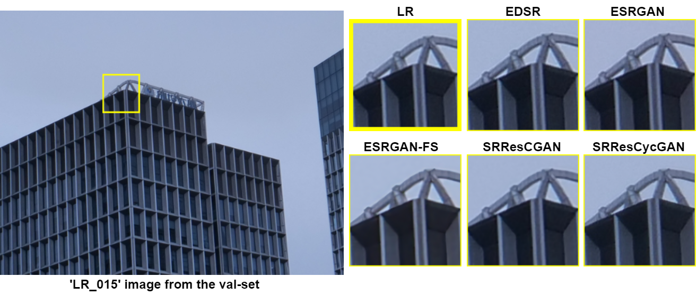
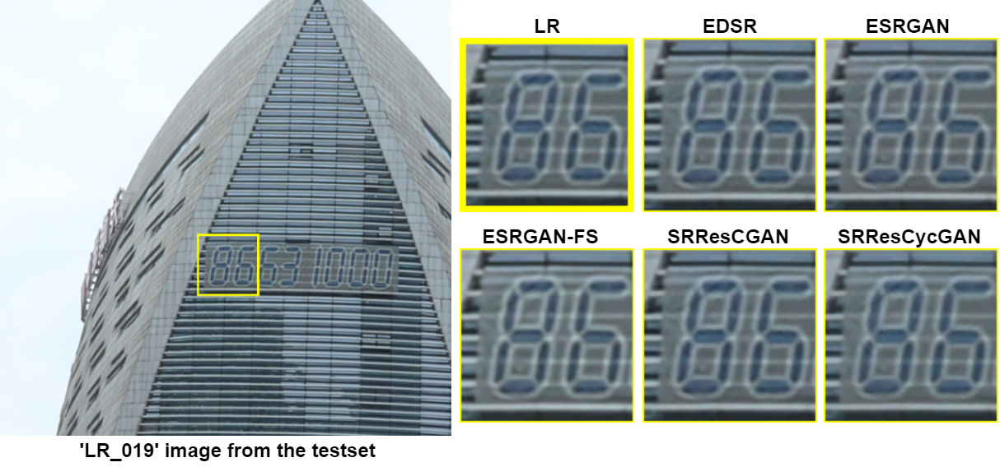
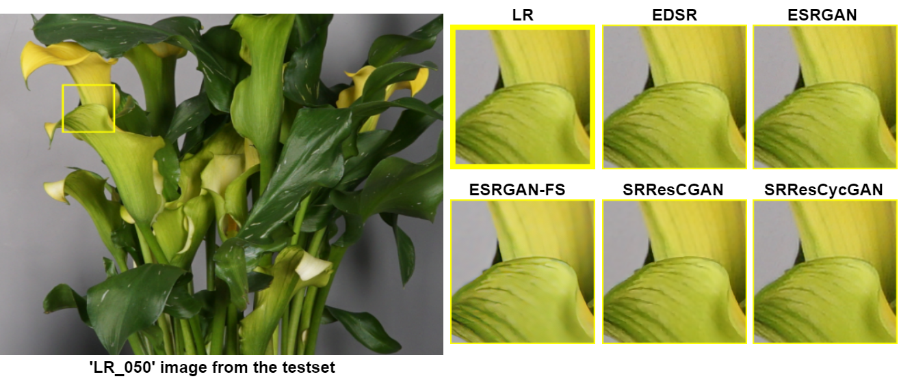

# Deep Cyclic Generative Adversarial Residual Convolutional Networks for Real Image Super-Resolution (SRResCycGAN)


An official PyTorch implementation of the [SRResCycGAN](https://github.com/RaoUmer/SRResCycGAN) network as described in the paper **[Deep Cyclic Generative Adversarial Residual Convolutional Networks for Real Image Super-Resolution](https://arxiv.org/abs/2009.03693)**. This work is participated in the [AIM 2020 Real-Image Super-resolution](https://data.vision.ee.ethz.ch/cvl/aim20/) challenge track-3 at the high x4 upscaling factor.

#### Abstract
> Recent deep learning based single image super-resolution (SISR) methods mostly train their models in a clean data domain where the low-resolution (LR) and the high-resolution (HR) images come from noise-free settings (same domain) due to the bicubic down-sampling assumption. However, such degradation process is not available in real-world settings. We consider a deep cyclic network structure to maintain the domain consistency between the LR and HR data distributions, which is inspired by the recent success of CycleGAN in the image-to-image translation applications. We propose the Super-Resolution Residual Cyclic Generative Adversarial Network (SRResCycGAN) by training with a generative adversarial network (GAN) framework for the LR to HR domain translation in an end-to-end manner. We demonstrate our proposed approach in the quantitative and qualitative experiments that generalize well to the real image super-resolution and it is easy to deploy for the mobile/embedded devices. In addition, our SR results on the AIM 2020 Real Image SR Challenge datasets demonstrate that the proposed SR approach achieves comparable results as the other state-of-art methods.

#### Spotlight Video
[](https://youtu.be/QD3yhDpG4Lo)

#### Pre-trained Models
| Datasets|[SRResCycGAN](https://github.com/RaoUmer/SRResCycGAN)|
|---|:---:|
|NTIRE2020 RWSR|[Sensor noise (&#x03C3; = 8)](https://drive.google.com/file/d/1-N05dWhnA6om16D1VoPASGB9MiTMjdgB/view?usp=sharing)|
|NTIRE2020 RWSR|[JPEG compression (quality=30)](https://drive.google.com/file/d/1AJqEm9lfrzkhJf24_ToEOi9iQUpUu2kn/view?usp=sharing)|
|NTIRE2020 RWSR|[Unknown corruptions](https://drive.google.com/file/d/1tPy1LwzRT2LUM2-X3BhGWo4C3Dii1gmV/view?usp=sharing)|
|AIM2020 RISR|[Real image corruptions](https://drive.google.com/file/d/1NAZjl6UDkcd_BnxfXmwF5QB-uHiJidnA/view?usp=sharing)|

#### BibTeX
    @InProceedings{Umer_2020_ECCVW,
                   author = {Muhammad Umer, Rao and Micheloni, Christian},
                   title = {Deep Cyclic Generative Adversarial Residual Convolutional Networks for Real Image Super-Resolution},
                   booktitle = {Proceedings of the European Conference on Computer Vision (ECCV) Workshops},
                   month = {August},
                   year = {2020}
                  }

## Quick Test

This model can be run on arbitrary images with a Docker image hosted on Replicate: https://beta.replicate.ai/RaoUmer/SRResCycGAN. Below are instructions for how to run the model without Docker:

#### Dependencies
- [Python 3.7](https://www.anaconda.com/distribution/) (version >= 3.0)
- [PyTorch >= 1.0](https://pytorch.org/) (CUDA version >= 8.0 if installing with CUDA.)
- Python packages:  `pip install numpy opencv-python`

#### Train models
- The SR training code is based on the [SRResCGAN](https://github.com/RaoUmer/SRResCGAN/tree/master/training_codes).

#### Test models
1. Clone this github repository as the following commands:
```
git clone https://github.com/RaoUmer/SRResCycGAN
cd SRResCycGAN
cd srrescycgan_code_demo
```
2. Place your own **low-resolution images** in the `./srrescycgan_code_demo/LR` folder. (There are two sample images i.e. LR_006 and LR_014).
3. Download the pretrained models from **Pre-trained Models** section. Place the models in `./srrescycgan_code_demo/trained_nets_x4`.
4. Run the test. You can config in the `test_srrescycgan.py`.
```
python test_srrescgan.py
```
5. The results are in the `./srrescycgan_code_demo/sr_results_x4` folder.

## SRResCycGAN Architecture
#### Overall Representative diagram
<p align="center">
  
</p>

## Quantitative Results
The x4 SR quantitative results comparison of our method with others over the DIV2K validation-set (100 images). The best performance is shown in **red** and the second best
performance is shown in **blue**.
<p align="center">
  
</p>

#### The AIM2020 Real Image SR Challenge Results (x4)
| <sub>Team</sub> | <sub>PSNR&#x2191;</sub> | <sub>SSIM&#x2191;</sub> | <sub>Weighed_score&#x2191;</sub> |
|:---:|:---:|:---:|:---:|
| <sub>Baidu</sub>| <sub>31.3960 </sub> |<sub>0.8751 </sub>|<sub>0.7099 (1)</sub>|
| <sub>ALONG</sub>| <sub>31.2369 </sub> |<sub>0.8742 </sub>|<sub>0.7076 (2)</sub>|
| <sub>CETC-CSKT</sub>| <sub>31.1226 </sub> |<sub>0.8744 </sub>|<sub>0.7066 (3)</sub>|
| <sub>SR-IM</sub>| <sub>31.2369 </sub> |<sub>0.8728 </sub>|<sub>0.7057 </sub>|
| <sub>DeepBlueAI</sub>| <sub>30.9638 </sub> |<sub>0.8737 </sub>|<sub>0.7044 </sub>|
| <sub>JNSR</sub>| <sub>30.9988 </sub> |<sub>0.8722 </sub>|<sub>0.7035</sub>|
| <sub>OPPO_CAMERA</sub>| <sub>30.8603 </sub> |<sub>0.8736 </sub>|<sub>0.7033</sub>|
| <sub>Kailos</sub>| <sub>30.8659 </sub> |<sub>0.8734 </sub>|<sub>0.7031</sub>|
| <sub>SR_DL</sub>| <sub>30.6045 </sub> |<sub>0.8660 </sub>|<sub>0.6944</sub>|
| <sub>Noah_TerminalVision</sub>| <sub>30.5870 </sub> |<sub>0.8662 </sub>|<sub>0.6944</sub>|
| <sub>Webbzhou</sub>| <sub>30.4174 </sub> |<sub>0.8673 </sub>|<sub>0.6936</sub>|
| <sub>TeamInception</sub>| <sub>30.3465 </sub> |<sub>0.8681 </sub>|<sub>0.6935</sub>|
| <sub>IyI</sub>| <sub>30.3191 </sub> |<sub>0.8655 </sub>|<sub>0.6911</sub>|
| <sub>MCML-Yonsei</sub>| <sub>30.4201 </sub> |<sub>0.8637 </sub>|<sub>0.6906</sub>|
| <sub>MoonCloud</sub>| <sub>30.2827 </sub> |<sub>0.8644 </sub>|<sub>0.6898</sub>|
| <sub>qwq</sub>| <sub>29.5878 </sub> |<sub>0.8547 </sub>|<sub>0.6748</sub>|
| <sub>SrDance </sub>| <sub>29.5952 </sub> |<sub>0.8523 </sub>|<sub>0.6729</sub>|
| <sub>**MLP_SR (ours)**</sub>| <sub>28.6185 </sub> |<sub>0.8314 </sub>|<sub>0.6457</sub>|
| <sub>EDSR</sub>| <sub>28.2120 </sub> |<sub>0.8240 </sub>|<sub>0.6356</sub>|
| <sub>RRDN_IITKGP</sub>| <sub>27.9708 </sub> |<sub>0.8085 </sub>|<sub>0.6201</sub>|
| <sub>congxiaofeng</sub>| <sub>26.3915 </sub> |<sub>0.8258 </sub>|<sub>0.6187</sub>|

## Visual Results
### DIV2K Validation-set (100 images)
Here are the SR resutls comparison of our method on the DIV2K validation-set images.
<p align="center">
  
</p>

### Real-Image SR Challenge dataset images ([Track-3](https://data.vision.ee.ethz.ch/cvl/aim20/))
#### Validation-set
You can download all the SR resutls of our method on the AIM 2020 Real-Image SR validation-set from the Google Drive: [SRResCycGAN](https://drive.google.com/file/d/1Y-co6-hazt6h9i07sulOka7j0Yeej4lc/view?usp=sharing).
<p align="center">
  
</p>
<p align="center">
  
</p>

#### Test-set
You can download all the SR resutls of our method on the AIM 2020 Real-Image SR test-set from the Google Drive: [SRResCycGAN](https://drive.google.com/file/d/1VjpxyK7yiD995FCdpbUeTpSv_oiWJTwD/view?usp=sharing).
<p align="center">
  
</p>
<p align="center">
  
</p>
